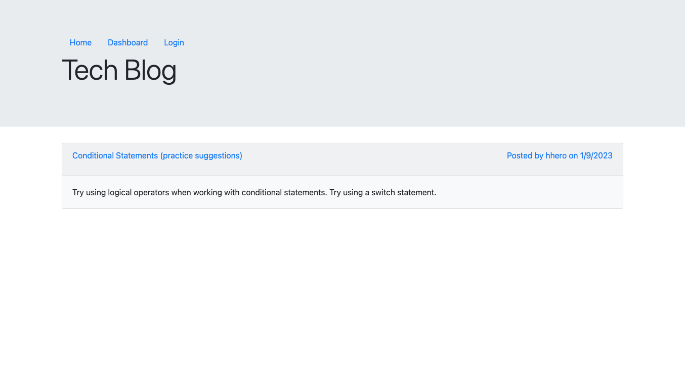

# Tech Blog (MVC)

## Description

On this tech blog site, users can add, update, and delete their blog posts as well as view and add comments to other blog posts. Users can sign up or log in and log out.

As part of the application, there are models, routes (get and post as well as delete and put), and methods in connection with CRUD. Please see the link to the repository below. The use of Express.js, express-handlebars, express-session, connect-session-sequelize, Node.js, Sequelize, MySQL2, MySQL, the dotenv package, the bcrypt package, jQuery, Bootstrap, the framework provided by edX Boot Camps LLC, and model-view-controller can be observed from there. 

## Links

Deployed to Heroku - the link to the deployed application: https://protected-beach-00139.herokuapp.com/

The link to the repository: https://github.com/jamscc/mvc-tech-blog

## Screenshot

## License

The license for the application: MIT License

badge (https://shields.io/)